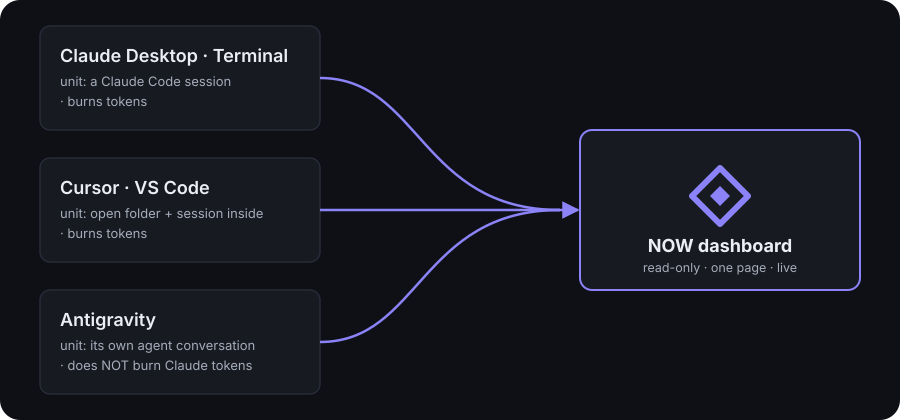

# Architecture — NOW dashboard

*🇬🇧 English · 🇻🇳 [Tiếng Việt](ARCHITECTURE.vi.md)*

File map, data sources, and four pitfalls that have already bitten. For why the design
looks the way it does, see [DESIGN.md](DESIGN.md); for the quota block specifically,
see [QUOTA.md](QUOTA.md).

## What it reads

Everything is a file already sitting on disk — the dashboard **only reads, never writes**.

| Source | Yields |
|---|---|
| `~/Projects/*/*/NOW.json` | focus, next action, decisions, who it's waiting on, queue, recently done |
| `~/.claude/sessions/<pid>.json` | live sessions: pid, cwd, name, opened-at |
| `~/.claude/projects/<cwd>/<uuid>.jsonl` | session name (`customTitle`/`aiTitle`) + last activity |
| `~/.claude/tasks/<sessionId>/*.json` | each session's todo list |
| `git` | branch, uncommitted files, commits behind the board's marker, extra worktrees |
| `ps -eo pid,ppid,lstart,args` | the HOST app of each session — Cursor, VS Code, Antigravity, Terminal, or Claude Desktop |
| `~/Library/…/{Cursor,Code}/User/globalStorage/storage.json` | which folders each editor has open (`backupWorkspaces`) |
| `~/.gemini/antigravity/agyhub_summaries_proto.pb` | Antigravity conversations: title, workspace, step count, created/updated marks |
| `~/.gemini/antigravity/conversations/<id>.db` | mtime = that conversation's last write |

The source of truth is still `/now update` run inside the actual project. The dashboard
is a mirror, not a pen.

### Plan tier — three sources, three trust levels

Usage answers *"how much of it have I spent"*; plan tier answers *"how much of **what**"*.
No source sends a denominator alongside its percentage, so without a plan tier, today's
58% and last month's 58% aren't comparable — upgrade your plan and the whole history
silently changes meaning.

| Tool | Read from | Does the server self-report the tier? |
|---|---|---|
| Claude | `~/.claude.json` → `oauthAccount.organizationRateLimitTier` | yes |
| Antigravity | localhost RPC `GetUserStatus` → `planInfo.planName` | yes |
| Cursor | **inferred** from `planUsage.includedSpend` ($20 → Pro) | **no** |

That's why the Cursor chip has a **dotted** border instead of solid, and its tooltip
says outright that it's a reverse price-table lookup. A stroke, not a color — the
daltonized theme collapses red/green, so color can never be the only channel carrying
a real distinction.

**Where this breaks first, and breaks silently:** the Cursor price table (`CURSOR_PLANS`
in [`src/collect/plans.js`](../src/collect/plans.js)). If Anysphere changes pricing or
adds a tier, the label goes wrong with nothing to flag it. The chosen failure mode is
the safe one: when the price can't be matched, print the measured number (`$25/month`)
instead of guessing a name — an unlabeled number is still correct, a wrongly-guessed
label sends the reader off to reconcile against an invoice and conclude the whole
dashboard is broken.

**Two places that are deliberately NOT read, even though they look like the right spot:**

- `platform.claude.com/api/oauth/usage` — has no field about the plan at all. Measured on
  this machine: `five_hour`, `seven_day`, `limits[]`, `extra_usage`, `spend` are all
  there, no tier field anywhere.
- **Keychain** `claudeAiOauth.rateLimitTier` — DOES have a field, and it's **stale**. On
  this machine it reads `default_claude_max_5x` while the account is actually on Max
  20x: the value is written at login and never touched again, so upgrading the plan
  doesn't update it. The worst kind of wrong — right format, right type, only the
  content is wrong — so no format check catches it, only eyeballing it against the app.

The one exception to "read-only": `~/.now-dashboard/` — the dashboard's own notebook
(daily token totals, quota snapshots, and the per-session host-app log). Never written
to `~/.claude` or into any project directory.

## Three surfaces



This machine runs three things at once, and they are **not the same kind of thing** —
the command center has to measure each one in its own unit:

| Surface | Unit | Burns Claude tokens? |
|---|---|---|
| Claude Desktop · Terminal | a Claude Code session | yes |
| Cursor · VS Code | an open folder, plus any Claude Code session running inside it | yes |
| Antigravity | a conversation with its own agent | **no** — doesn't touch Claude Code at all |

A project card can jump straight to "open in Cursor / Antigravity"; the list of allowed
apps is hard-coded in `server.js`, not taken as a free-form name from the client.

## Three easy mistakes

The quota block has its own pitfalls (the two-way color scale, how "ran out before
reset" is handled) — see [QUOTA.md](QUOTA.md). The three below are about sessions
and hosts.

**1. Live vs. dead session.** `~/.claude/sessions/` doesn't clean itself up. Checking
with `kill -0 <pid>` will report "alive" even for files whose PID has since been
reassigned by the OS to an unrelated process. You have to cross-check the process's
actual start time too.

**2. `procStart` is recorded in UTC, `ps lstart` prints local time.** Comparing the
strings directly means **no session ever matches** (off by exactly 7 hours on this
machine). Both have to be normalized to epoch first, with a 2-second tolerance — see
[`src/collect/sessions.js`](../src/collect/sessions.js).

**3. `claude-vscode` is ONE name for THREE editors.** VS Code, Cursor, and every other
fork share the same extension, so the transcript logs them identically — on this
machine that's 29% of token volume sitting under a label that distinguishes nothing.
The only thing that can tell them apart is the process tree, and the process tree dies
with the session; so [`src/collect/hosts.js`](../src/collect/hosts.js) commits the host
app to its log the moment the session is still observably alive. Older history stays
under "Unknown editor," and the Token screen **states that ratio outright** instead of
lumping it in blindly.

## Layout

```
server.js              HTTP + SSE, zero-dep; watches fs, batches events, rescans every 30s
src/config.js           health thresholds, paths, port
src/state.js            merges every source into one snapshot; attaches sessions to
                        projects; passes each quota window's open time to the token
                        scan so it can attach the dollar estimate back
src/collect/now.js      scans NOW.json, validates schema v1, scores health
src/collect/sessions.js  detects genuinely live sessions + session name + last activity
src/collect/procs.js    one shared `ps` pass: guards against PID reuse + finds host app
src/collect/hosts.js    log of "which session ran in which app," to attribute tokens
                        to the right editor
src/collect/antigravity.js  Antigravity conversations, read from an undocumented protobuf
src/collect/agturns.js  each individual Antigravity model call — timestamp, model,
                        context; reads the gen_metadata table in each conversation's SQLite
src/collect/cursor.js   Cursor plan usage + in-editor rhythm (lines accepted, Tab
                        acceptance rate)
src/collect/cursorevents.js  log of individual Cursor calls — the timeline; pulled in the
                        BACKGROUND, overwrites the last two days each round, persisted to
                        ~/.now-dashboard/cursor-events.json
src/collect/editors.js  open Cursor/VS Code folders
src/collect/git.js      branch, drift, dirty files, extra worktrees
src/collect/tasks.js    each session's todo list
src/lib/pb.js           wire-level protobuf reader, no .proto file needed
public/app.js           shell: routing, keybindings, drawers, keeps scroll position across
                        every redraw
public/lib/butler.js    the butler's voice: TWO fixed slots — worth-doing items + token quota
public/lib/game.js      numbers measured directly: streak, done7, project status as text
public/lib/chart.js     bar / area / lollipop / stacked bar / donut / treemap, plain HTML+CSS
public/lib/skin.js      chart rendering styles + the "which shape fits which data" guardrail
public/lib/quota.js     turns quota numbers into sentences: spent, wasted, color scale,
                        reset time, the window's estimated dollar cost — the target is
                        to spend it all
public/lib/tip.js       tooltip label↔value formatting, packed into a single HTML attribute
public/lib/surface.js   name and glyph for each work surface
public/lib/tabs.js      Token screen's tab state, kept outside the DOM, remembered via
                        localStorage
public/styles.css       the HUD design system (tokens, cornered frames, gauges)
public/views/           7 screens, one file each — except views/tools.js, which is half
                        the Cursor + Antigravity content of the Token screen, not a
                        screen of its own
```

`/api/now-md?project=<id>` returns the full text of `NOW.md`; the minimal markdown
renderer lives right inside `app.js` — just enough for headings, bullets, bold/italic,
`code`, blockquotes, exactly what `/now update` generates. No library pulled in just to
display a file the app generates itself; content is escaped first, then syntax is
recognized.

## Configuring

Set environment variables before running:

```bash
NOW_PORT=5000 NOW_ROOTS=~/Projects,~/work ./bin/now-dash
```

The "can this board still be trusted" thresholds live in `HEALTH` in
[`src/config.js`](../src/config.js) — defaults: drifting from 3 days / 5 commits,
expired from 7 days / 15 commits.
