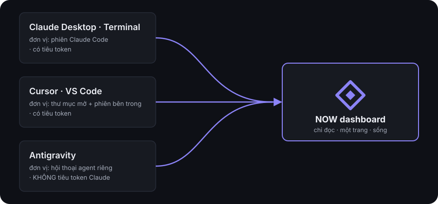

# Kiến trúc — NOW dashboard

*🇻🇳 Tiếng Việt · 🇬🇧 [English](ARCHITECTURE.md)*

Bản đồ file, nguồn dữ liệu, và bốn cạm bẫy đã từng sập. Vì sao thiết kế trông thế này xem
[DESIGN.vi.md](DESIGN.vi.md); khối hạn mức xem riêng [QUOTA.vi.md](QUOTA.vi.md).

## Nó đọc gì

Tất cả đều là file có sẵn trên máy — dashboard **chỉ đọc, không bao giờ ghi**.

| Nguồn | Cho ra |
|---|---|
| `~/Projects/*/*/NOW.json` | focus, next action, quyết định, chờ ai, hàng đợi, vừa xong |
| `~/.claude/sessions/<pid>.json` | phiên đang sống: pid, cwd, tên, lúc mở |
| `~/.claude/projects/<cwd>/<uuid>.jsonl` | tên phiên (`customTitle`/`aiTitle`) + hoạt động cuối |
| `~/.claude/tasks/<sessionId>/*.json` | danh sách việc của từng phiên |
| `git` | nhánh, file chưa commit, số commit lệch khỏi mốc board, worktree phụ |
| `ps -eo pid,ppid,lstart,args` | app CHỦ của mỗi phiên — Cursor, VS Code, Antigravity, Terminal hay Claude Desktop |
| `~/Library/…/{Cursor,Code}/User/globalStorage/storage.json` | thư mục các editor đang mở (`backupWorkspaces`) |
| `~/.gemini/antigravity/agyhub_summaries_proto.pb` | hội thoại Antigravity: tiêu đề, workspace, số bước, mốc tạo/cập nhật |
| `~/.gemini/antigravity/conversations/<id>.db` | mtime = lần ghi cuối của hội thoại đó |

Nguồn sự thật vẫn là `/now update` chạy trong chính dự án. Dashboard là cái gương,
không phải cái bút.

### Bậc gói — ba nguồn, ba mức tin cậy

Hạn mức trả lời *"đã tiêu bao nhiêu phần"*; bậc gói trả lời *"bao nhiêu phần **của cái
gì**"*. Không nguồn nào gửi mẫu số kèm phần trăm, nên thiếu bậc gói thì 58% hôm nay và
58% tháng trước không so được — nâng gói xong là cả lịch sử lặng lẽ đổi nghĩa.

| Công cụ | Đọc ở đâu | Server tự khai tên gói? |
|---|---|---|
| Claude | `~/.claude.json` → `oauthAccount.organizationRateLimitTier` | có |
| Antigravity | RPC `GetUserStatus` ở localhost → `planInfo.planName` | có |
| Cursor | **suy ra** từ `planUsage.includedSpend` ($20 → Pro) | **không** |

Chip Cursor vì thế mang **viền chấm** thay vì viền liền, và tooltip nói thẳng nó là phép
tra ngược bảng giá. Nét chứ không phải màu — theme daltonized làm đỏ/lục hết phân biệt,
nên màu không bao giờ được là kênh duy nhất chở một khác biệt có thật.

**Chỗ sẽ hỏng trước, và hỏng im lặng:** bảng giá Cursor (`CURSOR_PLANS` trong
[`src/collect/plans.js`](../src/collect/plans.js)). Anysphere đổi giá hoặc thêm bậc là cái
tên sai mà không có gì báo. Đã chọn cách hỏng an toàn: giá không tra được thì in đúng số
đo được (`$25/tháng`) chứ không đoán tên — một con số không tên vẫn đúng, một cái tên
đoán sai thì người đọc mang đi đối chiếu hoá đơn rồi kết luận cả dashboard hỏng.

**Hai chỗ KHÔNG được đọc, dù chúng có vẻ đúng chỗ hơn:**

- `platform.claude.com/api/oauth/usage` — không có một trường nào về gói. Đo trên máy
  này: đủ `five_hour`, `seven_day`, `limits[]`, `extra_usage`, `spend`, không chữ tier nào.
- **Keychain** `claudeAiOauth.rateLimitTier` — CÓ trường, và nó **cũ**. Máy này đọc ra
  `default_claude_max_5x` trong khi tài khoản đang là Max 20x: giá trị ghi lúc đăng nhập
  rồi nằm im, nâng gói không viết lại nó. Sai kiểu tệ nhất — đúng định dạng, đúng kiểu,
  chỉ sai nội dung, nên không phép kiểm tra nào bắt được ngoài đối chiếu bằng mắt với app.

Ngoại lệ duy nhất của "chỉ đọc": `~/.now-dashboard/` — sổ riêng của dashboard (tổng
token theo ngày, ảnh chụp hạn mức, và sổ app chủ của từng phiên). Không bao giờ ghi
vào `~/.claude` hay vào thư mục dự án.

## Ba bề mặt làm việc



Máy này chạy ba thứ cùng lúc, và chúng **không cùng loại** — sở chỉ huy phải đo mỗi
thứ bằng đúng đơn vị của nó:

| Bề mặt | Đơn vị | Có tiêu token Claude không |
|---|---|---|
| Claude Desktop · Terminal | phiên Claude Code | có |
| Cursor · VS Code | thư mục đang mở, cộng phiên Claude Code chạy bên trong | có |
| Antigravity | hội thoại của agent riêng | **không** — nó không đụng gì tới Claude Code |

Từ thẻ dự án bấm được thẳng "mở trong Cursor / Antigravity"; danh sách app cho phép
khoá cứng ở `server.js`, không nhận tên tự do từ client.

## Ba chỗ dễ làm sai

Khối hạn mức có cạm bẫy riêng của nó (thang màu hai chiều, cách trừ "cạn trước reset") —
xem [QUOTA.vi.md](QUOTA.vi.md). Ba chỗ dưới đây là về phiên và host.

**1. Phiên sống hay đã chết.** `~/.claude/sessions/` không tự dọn. Kiểm tra bằng
`kill -0 <pid>` sẽ báo sống cho cả những file mà PID đã được hệ điều hành cấp lại cho
tiến trình khác. Phải đối chiếu thêm thời điểm khởi động tiến trình.

**2. `procStart` ghi theo UTC, `ps lstart` in theo giờ địa phương.** So chuỗi trực tiếp
thì **không phiên nào khớp** (lệch đúng 7 tiếng ở máy này). Phải quy về epoch rồi so,
cho phép sai lệch 2 giây — xem [`src/collect/sessions.js`](../src/collect/sessions.js).

**3. `claude-vscode` là MỘT cái tên cho BA cái editor.** VS Code, Cursor và mọi bản
fork khác đều dùng chung extension nên transcript ghi y hệt nhau — trên máy này đó là
29% lượng token đứng dưới một nhãn không phân biệt được gì. Thứ duy nhất tách được
chúng là cây tiến trình, mà cây tiến trình thì chết theo phiên; nên
[`src/collect/hosts.js`](../src/collect/hosts.js) chốt app chủ vào sổ ngay khi còn nhìn
thấy phiên sống. Phần lịch sử cũ vẫn nằm ở "Editor chưa rõ" và màn Token **nói ra tỉ lệ
đó** thay vì gộp bừa.

## Cấu trúc

```
server.js              HTTP + SSE, zero-dep; theo dõi fs, gom sự kiện, quét lại mỗi 30s
src/config.js          ngưỡng sức khoẻ, đường dẫn, cổng
src/state.js           gộp mọi nguồn thành một snapshot; gắn phiên vào dự án; gửi mốc mở
                       của từng cửa sổ hạn mức sang lượt quét token rồi gắn tiền ngược lại
src/collect/now.js     quét NOW.json, validate schema v1, chấm sức khoẻ
src/collect/sessions.js  phát hiện phiên sống thật + tên phiên + hoạt động cuối
src/collect/procs.js   một lượt `ps` dùng chung: chống PID tái dùng + tìm app chủ
src/collect/hosts.js   sổ "phiên nào chạy trong app nào", để quy token về đúng editor
src/collect/antigravity.js  hội thoại Antigravity, đọc từ protobuf không có tài liệu
src/collect/agturns.js từng lượt gọi model của Antigravity — mốc thời gian, model, ngữ
                       cảnh; đọc bảng gen_metadata trong SQLite của từng hội thoại
src/collect/cursor.js  hạn mức gói Cursor + nhịp trong editor (dòng nhận, tỉ lệ Tab)
src/collect/cursorevents.js  sổ từng lượt gọi Cursor — trục thời gian; kéo ở NỀN, ghi đè
                       hai ngày cuối mỗi lượt, chốt vào ~/.now-dashboard/cursor-events.json
src/collect/editors.js thư mục Cursor/VS Code đang mở
src/collect/git.js     nhánh, độ lệch, file bẩn, worktree phụ
src/collect/tasks.js   todo của từng phiên
src/lib/pb.js          bộ đọc protobuf mức dây, không cần .proto
public/app.js          khung: định tuyến, phím tắt, ngăn kéo, giữ cuộn qua mỗi lượt vẽ
public/lib/butler.js   giọng quản gia: HAI ô cố định — việc đáng làm + hạn mức token
public/lib/game.js     số đo được thẳng: streak, done7, tình trạng dự án bằng chữ
public/lib/chart.js    cột / vùng / kẹo mút / thanh / quạt tròn / treemap, HTML-CSS thuần
public/lib/skin.js     phong cách vẽ chart + hàng rào "hình nào hợp với kiểu dữ liệu nào"
public/lib/quota.js    hạn mức đọc thành câu: đã tiêu, bỏ phí, thang màu, mốc reset, tiền
                       ước tính của cửa sổ — đích là tiêu hết
public/lib/tip.js      định dạng tooltip nhãn ↔ trị, nhét vừa một thuộc tính HTML
public/lib/surface.js  tên và ký hiệu của từng bề mặt làm việc
public/lib/tabs.js     tab của màn Token: trạng thái sống ngoài DOM, nhớ qua localStorage
public/styles.css      hệ thiết kế HUD (tokens, khung góc, thanh đo)
public/views/          7 màn, mỗi màn một file — trừ views/tools.js là nửa Cursor +
                       Antigravity của màn Token, không phải một màn riêng
```

`/api/now-md?project=<id>` trả toàn văn `NOW.md`; bản dựng markdown tối thiểu nằm
ngay trong `app.js` — chỉ đủ tiêu đề, gạch đầu dòng, đậm/nghiêng, `code`, trích
dẫn, đúng những gì `/now update` sinh ra. Không kéo thư viện về chỉ để hiện một
file mình tự sinh; nội dung được escape trước rồi mới nhận diện cú pháp.

## Chỉnh

Đặt biến môi trường trước khi chạy:

```bash
NOW_PORT=5000 NOW_ROOTS=~/Projects,~/work ./bin/now-dash
```

Ngưỡng "board còn tin được không" nằm ở `HEALTH` trong
[`src/config.js`](../src/config.js) — mặc định: lệch từ 3 ngày / 5 commit, hết hạn từ
7 ngày / 15 commit.
